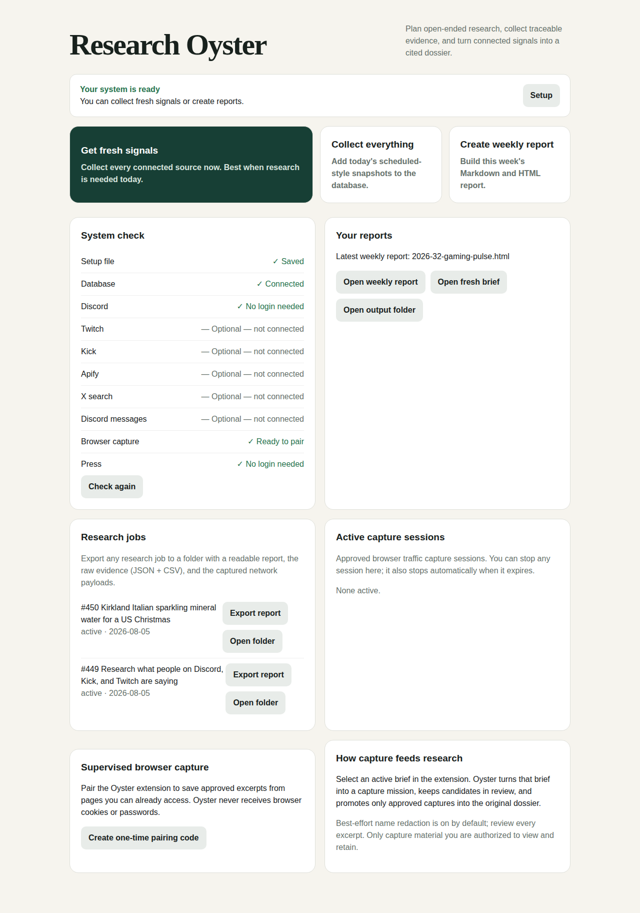

# Research Oyster

Research Oyster is a local, source-agnostic research engine for Claude Code, Codex, and other MCP-compatible AI hosts. Give it an ordinary research brief; it finds where the topic is actually discussed, reads the real threads and comments, and returns a report that **answers the question** — an executive answer, themes backed by cited quotes, tensions, sentiment, recommendations, and an honest note on confidence. The raw evidence and network payloads are saved as an appendix, not handed back as the answer.

The repository also includes Gaming Culture Pulse, a browser control center and reporting workflow built on the same collection foundation.

The optional **Research Oyster Capture** browser extension adds supervised evidence capture for Discord, X, Twitch chat, Reddit, and other pages a researcher can already access. Candidates stay in the extension until the user explicitly approves them; approved excerpts enter the original research job and dossier.

The optional **Research Oyster Studio** is a local chat UI where you talk to the research agent and **watch it work live** — every tool call, every raw result, and the report inline — running on your own Claude subscription (no API key). See [docs/STUDIO.md](docs/STUDIO.md).

## What a user gives Oyster

Only a subject and the decision the research should support are required:

> Research Kirkland Italian sparkling mineral water for a US Christmas 2026 campaign. Find consumer tensions, competitor activity, and three creative opportunities.

Audience, market, time period, required platforms, exclusions, and output format are optional. Oyster recommends relevant sources and creates source-specific queries. It does not force Twitch or Discord into research where they add no value.

## Fastest setup (one line)

On macOS or Linux, paste this into a terminal:

```sh
curl -fsSL https://raw.githubusercontent.com/zandemha2025/research-oyster/claude/demo-prep-p0iazw/install.sh | bash
```

This installs the current **Studio** build (the live chat UI) and opens Studio when it finishes — not the older control center. It downloads Oyster, installs Python and PostgreSQL if they are missing, creates and migrates a local database, and attaches Oyster to Claude Code / Codex. It is safe to re-run and never overwrites an existing `.env` or database. (macOS needs [Homebrew](https://brew.sh); the script tells you if it is missing.) Then restart your AI host and ask: “Use Research Oyster to research …”.

> Studio currently lives on the `claude/demo-prep-p0iazw` branch (the command above installs it). The plain `…/main/install.sh` one-liner installs the older control-center build instead — use the command above to get Studio.

## Manual setup on macOS

1. Download or clone this repository.
2. Double-click `Install Gaming Pulse.command`.
3. Follow the Homebrew prompt if it appears, then run the installer again.
4. Wait for the local control center to open.
5. Click **Setup** and add only the source credentials you want.
6. Double-click `Attach Research Oyster.command`.
7. Restart Claude Code or Codex.
8. Ask your AI host: “Use Research Oyster to research …”

To add supervised browser capture, open `chrome://extensions` or `edge://extensions`, enable Developer mode, choose **Load unpacked**, and select the repository's `browser_extension` folder. In Oyster's control center, create a one-time pairing code and enter it in the extension settings.

The database is required. Every external connector is optional. The installer creates a local PostgreSQL database and isolated Python environment without replacing an existing `.env` file or database.

For the complete beginner walkthrough, credential instructions, manual Linux setup, verification, and troubleshooting, read [docs/SETUP.md](docs/SETUP.md).

## Using Research Oyster: step by step

### 1. Install it (once)

Run the one-line installer above. It sets up the database and attaches Oyster to Claude Code / Codex.

### 2. Restart your AI host

Quit and reopen Claude Code (or Codex) so it picks up the new tool. There is nothing else to "launch" — you talk to Oyster through your AI host in plain English.

### 3. Ask for research in plain English

Type a normal request. You don't list feeds or platforms — Oyster plans that itself. Concrete examples:

**Social sentiment across platforms**
> Use Research Oyster to research what people on Discord, Kick, and Twitch are saying about the new Spider-Man movie. Check which sources are ready first, use the ones that are, and export the report when you're done.

**Brand / campaign research**
> Use Research Oyster to study Kirkland Italian sparkling mineral water for a US Christmas 2026 campaign. Find consumer tensions, competitor activity, and three creative territories. Cite every claim and tell me what you couldn't cover.

**Market / competitive map**
> Use Research Oyster to map how US college students discuss affordable gaming laptops across Reddit, X, and tech press over the last six months. Give me a cited opportunity map and clearly flag unavailable sources.

**Resume earlier work**
> Use Research Oyster to list my recent research jobs, resume the Spider-Man one, fill the biggest gaps, and re-export the report.

### 4. What Oyster does with that

1. **Decomposes** the brief into the specific sub-questions and entities it needs to answer.
2. **Discovers** where the conversation actually happens — subreddits, forums, threads, videos, articles — using free web search (no key required; a search key makes it more reliable).
3. **Reads the real discussion**: Reddit posts and comments (free, no key), articles and forum threads, and any platform connectors whose credentials you've added. It stores what people actually said, with full provenance, deduplicated. If a source needs credentials you haven't added, it routes around it to where the topic is public — it does **not** hand you a setup to-do list as the answer.
4. **Iterates** until it can answer confidently, then **writes the report** that answers your question.
5. **Exports** a folder you can open and share, led by that report.

### 5. Get the results as files

Ask the host to export (or click **Export report** in the dashboard). Each job produces a folder under `output/`:

- `report.md` and `report.html` — a readable, cited report
- `evidence.json` and `evidence.csv` — the raw evidence (CSV opens in any spreadsheet)
- `raw_responses.jsonl` — the redacted network payloads collected during the run

### 6. The dashboard (optional)

Reopen it any time with `Open Gaming Pulse.command` (macOS) or `python control_center.py`. It shows readiness, your research jobs with one-click **Export report** / **Open folder**, active capture sessions, and report shortcuts.



### 7. Sources behind a login, without API keys (optional)

For data on pages you're already signed into — a Discord server you're in, X, etc. — the **Research Oyster Capture** browser extension captures what those pages load, with your approval. The dashboard's **"Set up browser capture"** panel walks you through it: it shows the exact folder to load (Chrome/Edge → Extensions → Developer mode → Load unpacked), the pairing code, and whether a browser is connected. Then in the extension popup you pick a job and click **Start capturing this site** — that's the on-switch; your click is the approval and it records that one site for 30 minutes or until you press Stop. You can also trust a domain once so it starts hands-free. (Chrome can't auto-install an unpacked extension, so loading it once is manual; see [browser_extension/README.md](browser_extension/README.md).) See also [docs/USAGE.md](docs/USAGE.md).

## Source support

| Source | What Oyster can do | What you need |
|---|---|---|
| Web search | Find where a topic is discussed and return ranked leads to pursue | Nothing (free DuckDuckGo); an optional Tavily/Brave/Serper key makes it reliable |
| Source discovery | Group leads into venues (Reddit, forums, YouTube, news, …) — "where is this conversation?" | Same as web search |
| Reddit | Search public posts and read whole threads' comments where the discussion actually lives | Nothing |
| Web page | Crawl a public page and save readable evidence | Nothing |
| RSS/Atom | Match and store feed entries | Public feed URL |
| X | Search recent public posts through the official API | X bearer token |
| X fallback | Run a user-selected Apify Actor | Apify token and Actor access |
| Reddit and other sites | Run a user-selected Apify Actor | Apify token and Actor access |
| Discord public metadata | Inspect a public invite | Invite URL or code |
| Discord messages | Read channels where your bot is explicitly admitted | Bot token, server permission, required intent |
| Twitch | Search arbitrary channels/topics | Twitch app credentials |
| Kick | Search active streams/topics | Kick app credentials |
| Host-native search | Save evidence found by Claude, Codex, or another tool | Whatever access that host uses |
| Supervised browser capture | Review and approve visible excerpts into the active brief | Chrome/Edge extension and access to the page |
| Approved-session browser traffic | Capture the network payloads a page you approve already receives, one domain at a time | Chrome/Edge extension, page access, and an explicit per-domain approval |

Every research job can be exported to a folder under `output/`. The report (`report.md` / `report.html`) leads with the answer — an executive summary, themes with cited quotes, tensions, sentiment, recommendations, and a confidence note — and demotes the raw evidence to an appendix. The folder also contains the raw evidence as `evidence.json` and `evidence.csv` and the redacted network payloads collected during the run as `raw_responses.jsonl`. Ask the host to export, or use the **Research jobs** panel in the control center. When a connector is not configured, Oyster routes around it to where the topic is public (free web search and Reddit) rather than stopping — a run answers the question and states its confidence honestly, instead of returning a list of gaps to go fix.

No credential is required unless the corresponding source is selected. API/provider charges are separate from Oyster.

See [docs/USAGE.md](docs/USAGE.md) for prompt templates, the individual MCP tools, the browser workflow, and command-line examples.

## Manual quick start

Requirements: Python 3.11+, PostgreSQL 15+, and Git.

```sh
git clone https://github.com/zandemha2025/research-oyster.git
cd research-oyster
python3 -m venv .venv
source .venv/bin/activate
pip install -r requirements.txt
cp .env.example .env
createdb gaming_pulse
python main.py migrate
```

Attach using the absolute path returned by `pwd`:

```sh
codex mcp add research-oyster -- "$(pwd)/research-oyster-mcp"
claude mcp add --scope user research-oyster -- "$(pwd)/research-oyster-mcp"
```

Run the browser control center with:

```sh
./Open\ Gaming\ Pulse.command  # macOS
# or
.venv/bin/python control_center.py
```

## Verification

```sh
.venv/bin/python -m unittest discover -s tests -p 'test_*.py' -q
.venv/bin/python tests/postgres_acceptance.py
.venv/bin/python tests/research_postgres_acceptance.py
```

The release was validated against a catalog of 99 user stories ([docs/FEATURE_STATUS.xlsx](docs/FEATURE_STATUS.xlsx)). The audit found and fixed several logistical, data-quality, and UX defects, then re-tested every behavior; continuous integration runs the full suite on every change.

## Important boundaries

Research Oyster is a collection and evidence-management tool, not a license to access restricted data. Use only public material or systems you are authorized to access. Follow platform terms, API terms, robots directives where applicable, privacy and employment rules, copyright law, and local consent requirements. Do not use it to bypass authentication, rate limits, access controls, bans, or technical protections. Do not collect sensitive personal data merely because it is technically visible.

Generated results can be incomplete, outdated, biased, or incorrect. Verify material claims and obtain professional advice before legal, medical, employment, financial, safety, or similarly consequential decisions. Read the full [DISCLAIMER.md](DISCLAIMER.md) before use and [SECURITY.md](SECURITY.md) before exposing or deploying the software.

## Security model

The included server uses local MCP stdio and the browser control center/capture API binds to `127.0.0.1:8765`. The extension pairs with a single-use code and a revocable token bound to its extension origin. Credentials are stored in the local `.env` file and are excluded from Git; the extension never receives them. This is not a production multi-user hosted service. Internet exposure requires authentication, tenant isolation, encrypted secret storage, rate limiting, audit logging, retention controls, and isolated collection workers.

## License

MIT. See [LICENSE](LICENSE). Third-party services, APIs, content, and Actors retain their own terms and licenses.
